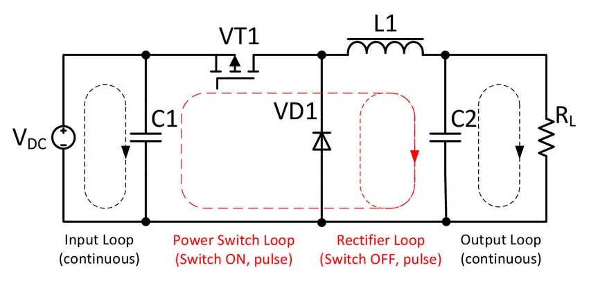

# Buck Converter




Понижающий цифровой преобразователь напряжения с web-интерфейсом.

__Разработчики__

* _electronic_ - [Алексей]()
* _frontend_ - [Михаил](https://github.com/mike5535)
* _embded_ - [Иван](https://github.com/AlfaIV)


__Инструкция__

1. Подключить микроконтроллер (МК) через кабель к ПК.
1. Настроить источник питания схемы на 15 вольт. Желательно ограничить ток потребления на 1.5 - 2 ампера для дополнительной защиты.
1. Проверить, что устройство с которого, планируеться управлять МК и сам контроллер подключены к опорной беспроводной сети.
1. Для того, что бы открыть в браузере интерфейс управления, в адресной строке набрать:
```
    stabilazer.local
```
 _Важно! Возможна ситуация, когда некоторые браузеры не подключаються к интерфейсу управелния. Возможно 2 решения проблемы. Использовать другой браузер. Или открыть COM порт на скорости 115200, там можно увидеть IP адерс, обратившись по которому, гарантированно откроеться интефейс._

5. Настроить требуемый режим управления.
1. Настроить конфигурацию схемы при помощи переключателей (выбрать L и С).   
1. Включить стабилизатор при помощи переключателя.


__Полезные ссылки__
* [Репозиторий с web-интерфейсом](https://github.com/Mike5535/webinterface_stabilizer)
* [Трассировка печатной платы]()
* [Прошивка программы](https://randomnerdtutorials.com/vs-code-platformio-ide-esp32-esp8266-arduino/)
(_!! Не забываем нажимать boot на МК во время прошивки_)
* [Прошивка web интерфейса](https://randomnerdtutorials.com/esp32-vs-code-platformio-spiffs/)