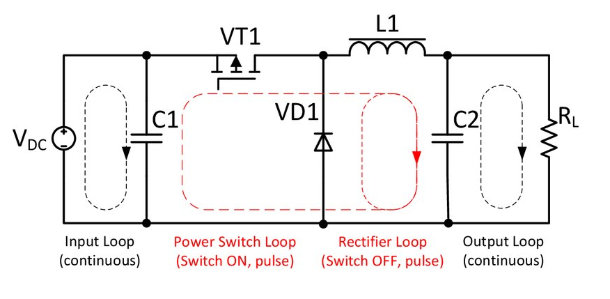

# Buck Converter




Понижающий цифровой преобразователь напряжения с web-интерфейсом.

#### Разработчики

* _lead_ - [Родин Михаил Валерьевич](https://www.mrodin.ru/)
* _electronic_ - [Алексей]()
* _frontend_ - [Михаил](https://github.com/mike5535)
* _embded_ - [Иван](https://github.com/AlfaIV)

#### Документация

* Исходный программный находиться в папках `include/` и `src/`. Программа для микроконтроллера разрабатывалась на С++ с использованием EPS32 Arduino API. В качестве среды разработки используется расширение для VsCode PlatformIO, однако требуется установленная ArduinoIDE так, как применяться Arduino API.<br/>

_Можно при необходимости вернуться к использованию ArduinoIDE. Для этого необходимо переименовать `src/main.cpp` в `scr/main.ino` и назвать папку проекта main. Также стоит проверить пути подключения функций программы в отдельных файла._

* Документация проекта оформленная согласно ГОСТ находиться в папке `doc/`.
* [Сcылка на проект в EasyEda c трассировкой платы проекта](https://oshwlab.com/rodin/dps_v1-0).<br/>
* [Сcылка на репозиторий с web-интерфейсом](https://github.com/Mike5535/webinterface_stabilizer). Также в проекте присутствует собранная версия интерфейса в папке `data/`, которую также можно загрузить в микроконтроллер без изучения репозитория с исходниками. Инструкция по прошивки микроконтроллера статикой представленная в ссылке [4] в разделе "Полезные ссылки".<br/>

#### Инструкция

1. Подключить микроконтроллер (МК) через кабель к ПК.
1. Настроить источник питания схемы на 15 вольт. Желательно ограничить ток потребления на 1.5 - 2 ампера для дополнительной защиты.
1. Проверить, что устройство с которого, планируется управлять МК и сам контроллер подключены к опорной беспроводной сети.
1. Для того, что бы открыть в браузере интерфейс управления, в адресной строке набрать:
```
    stabilazer.local
```
 _Важно! Возможна ситуация, когда некоторые браузеры не подключаються к интерфейсу управелния. Возможно 2 решения проблемы. Использовать другой браузер. Или открыть COM порт на скорости 115200, там можно увидеть IP адерс, обратившись по которому, гарантированно откроеться интефейс._

5. Настроить требуемый режим управления.
1. Настроить конфигурацию схемы при помощи переключателей (выбрать L и С).   
1. Включить стабилизатор при помощи переключателя.
1. При использовании web-интерфейса обращать внимание на панель с параметрами схемы слева. Она отображает настройки, которые загружены в МК. И не забывать после ввода параметра в поле интерфейса нажимать клавишу `Enter` для загрузки параметра в память МК. И следить за тем, чтобы изменилось соответствующее поле слева.


#### Полезные ссылки
1. [Репозиторий с web-интерфейсом](https://github.com/Mike5535/webinterface_stabilizer)
1. [Трассировка печатной платы](https://oshwlab.com/rodin/dps_v1-0)
1. [Прошивка программы](https://randomnerdtutorials.com/vs-code-platformio-ide-esp32-esp8266-arduino/)
(_!! Не забываем нажимать boot на МК во время прошивки_)
1. [Прошивка web интерфейса](https://randomnerdtutorials.com/esp32-vs-code-platformio-spiffs/)
1. [Электропитание? Это просто!](https://www.youtube.com/@electropitanie)
